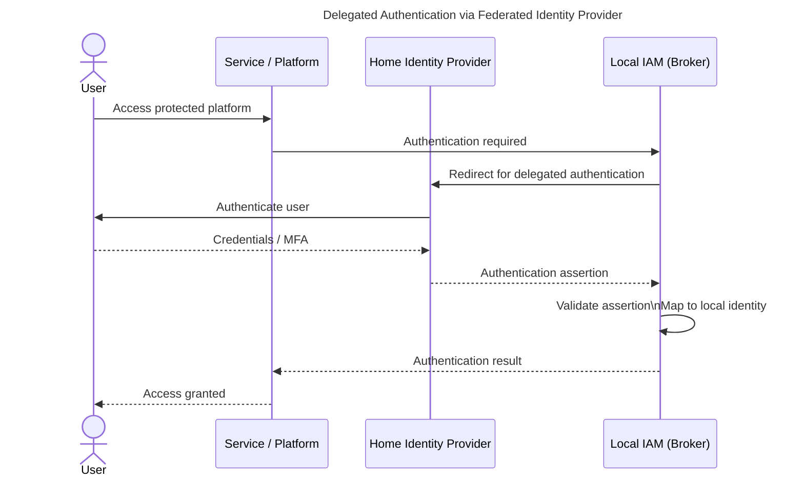
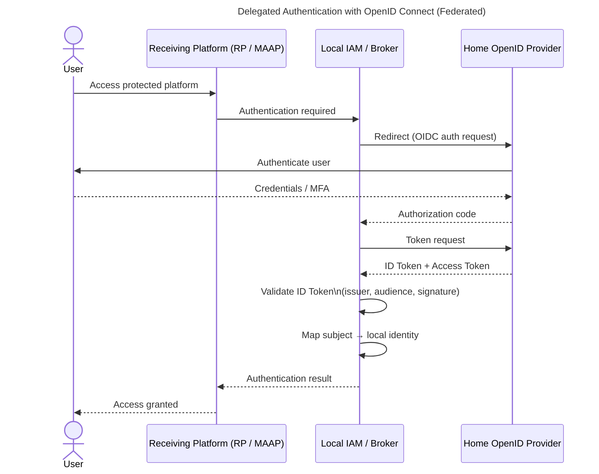
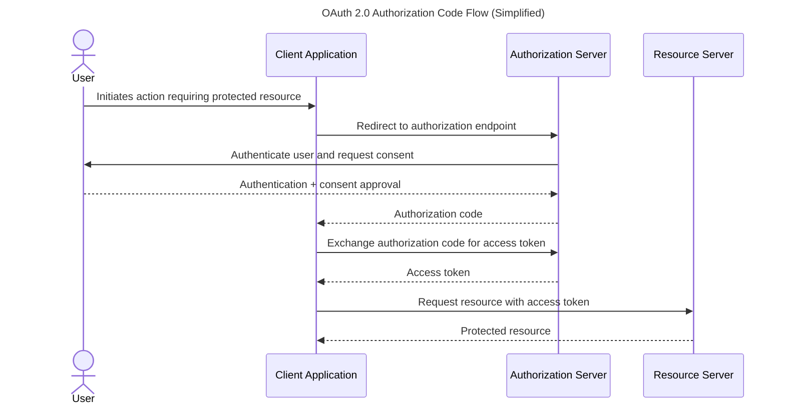
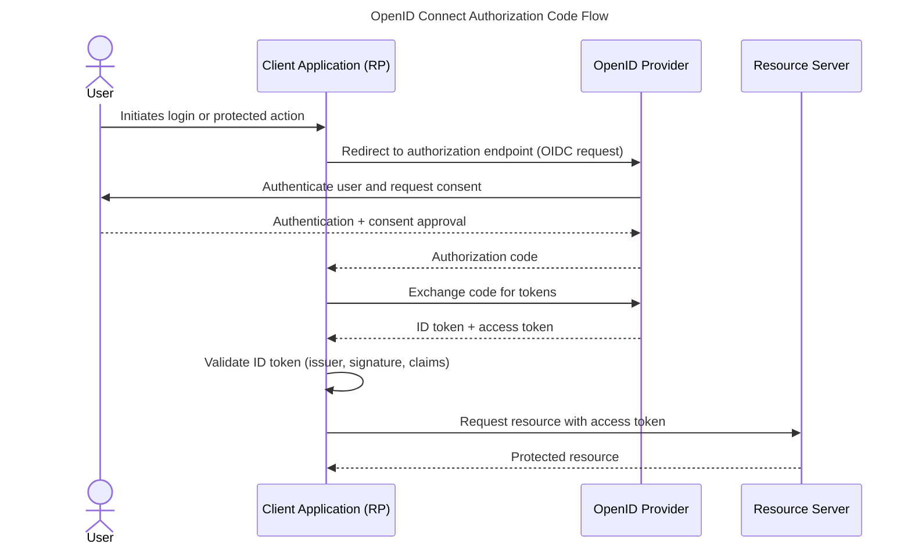

# Generated Mermaid Diagrams

This file is generated from Mermaid source files in `WhitePaper/img`.

### Delegated Authentication via Federated Identity Provider

### delegated oidc

### OAuth 2.0 Authorization Code Flow

### OpenID Connect Authorization Code Flow

